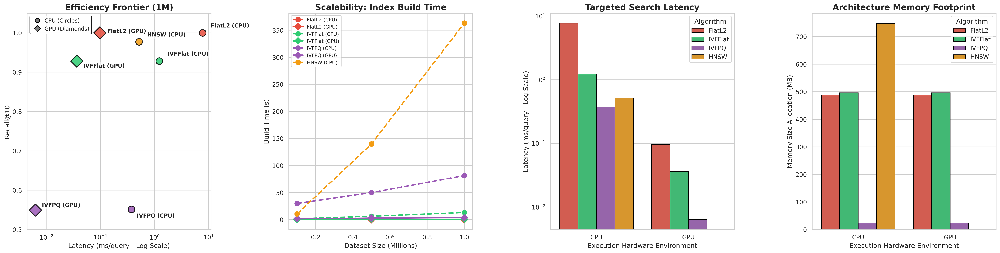
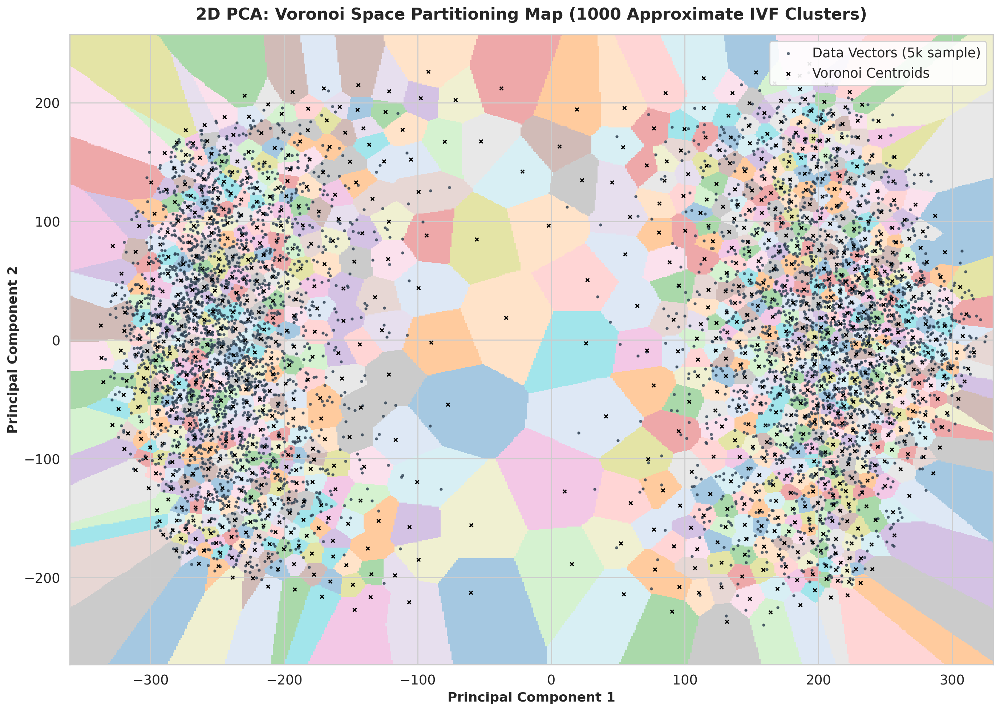
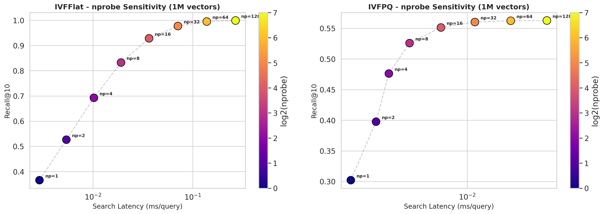

# FAISS CPU vs. GPU Architectural Benchmark 🚀


A comprehensive architectural benchmark and scaling analysis of the **Facebook AI Similarity Search (FAISS)** library on the standard **SIFT1M dataset**. 

This project explicitly explores the hard computational thresholds and boundaries between standard **CPU sequential execution** and massively parallel **GPU tensor execution** across varying multi-scale dataset deployments. 

---

## 📂 Repository Structure

```text
FAISS-CPU-GPU-Benchmark/
├── assets/                    # Graphical plots and visuals
├── notebook/
│   └── FAISS_Assignment_Benchmark.ipynb  # Primary execution notebook (Colab Ready)
├── report/
│   └── CSE488_FAISS_Report.tex           # IEEE Formatted Academic Report (LaTeX)
└── README.md
```

## 📊 1. Multi-Scale Architecture Analysis

Evaluating FAISS architectures explicitly balancing execution streams physically across CPU vs GPU clusters demonstrates hard operational ceilings.



### Key Hardware Thresholding Takeaways:
- **High-Performance Computing:** If parallel hardware acceleration is available, brute force calculations (\texttt{FlatL2}) are heavily saved by parallel mathematics. However, marrying algorithmic approximations together with CUDA processing (`IndexIVFFlat`) creates the undisputed performance king, yielding **>0.92 precision** at a blinding velocity of **0.037 milliseconds** per operation.
- **Zero-GPU Architectures:** The topological structure bound within `IndexHNSWFlat` firmly cements it as the absolute best CPU-only index. Navigating spatial graphs entirely bypasses exhaustive CPU loops, yielding phenomenal high-90 recall metrics completely independent of graphical processing units.

---

## 🧮 2. Vector Space & Voronoi Partitioning

To understand *why* approximate algorithms succeed, we can mathematically project the 128-dimensional vector space into 2D via PCA and cluster the space.



By generating 1,000 **Voronoi cells**, we visually map FAISS's underlying Inverted File (IVF) indexing structure. `IndexIVFFlat` assigns every query strictly to the few nearest centroids. This allows the system to completely ignore the vast majority of irrelevant spatial partitions, confidently bypassing over 90% of exhaustive distance calculations.

---

## 🎛️ 3. Hyperparameter Sensitivity (`nprobe`)

The `nprobe` parameter algorithmically governs how many of the generated Voronoi cells are actively scanned during a search query.



- **The Product Quantization Ceiling:** Notice that `IVFFlat` steadily continues climbing toward true 1.0 precision at higher `nprobe` settings. Conversely, `IVFPQ` hits a harsh, insurmountable ceiling (stopping around a maximum recall of ~0.60). Because `IVFPQ` aggressively compresses the vectors into highly lossy 8-bit integers, it inherently loses strict metric precision. No matter how many partitioned cells the algorithm actively searches, the mathematical accuracy ceiling enforced by its initial compression loss cannot be breached.

---

## 📈 Final Evaluation Metrics (1M Vectors)

The following table extracts the core performance mapping the exact drop-offs generated when pushing algorithms to the GPU.

| Algorithm | Build Time (CPU / GPU) | Search Latency (CPU / GPU) | Recall@10 | Memory Footprint |
| :--- | :--- | :--- | :--- | :--- |
| **FlatL2** (Exact) | 0.34s / 0.11s | 7.78 ms / 0.09 ms | **1.000** | ~488 MB |
| **IVFFlat** | 13.3s / 0.86s | 1.23 ms / **0.03 ms** | 0.928 | ~496 MB |
| **IVFPQ** | 81.4s / 3.81s | 0.37 ms / **0.006 ms** | 0.551 | **~23.5 MB** |
| **HNSW** | 363.3s / N/A | **0.52 ms** / N/A | 0.977 | ~747 MB |

---

## 🚀 How to Run

1. Open `notebook/FAISS_Assignment_Benchmark.ipynb` in **Google Colab**.
2. Go to `Runtime` -> `Change runtime type` and select **T4 GPU**.
3. Hit `Run All`. The script will automatically download the dataset, compile the CPU and GPU indices, generate the mathematical visuals, and output the styled Pandas matrices.
